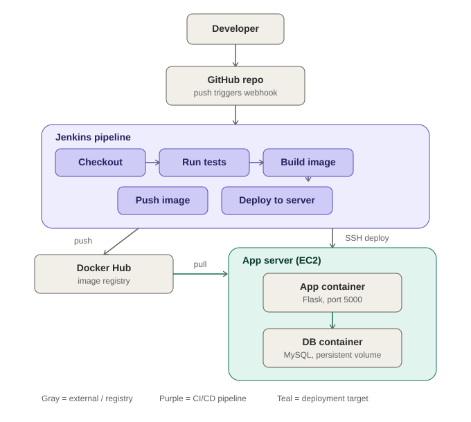
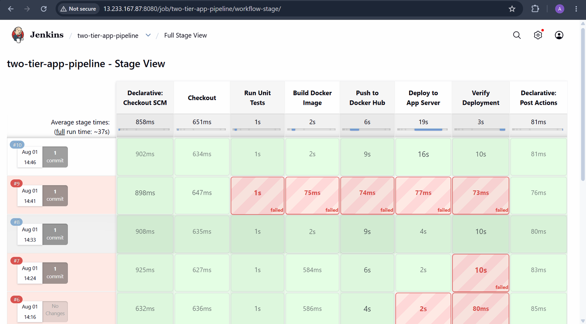
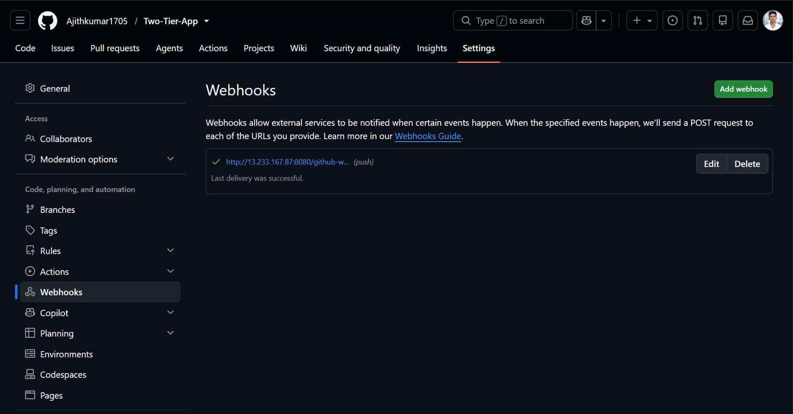
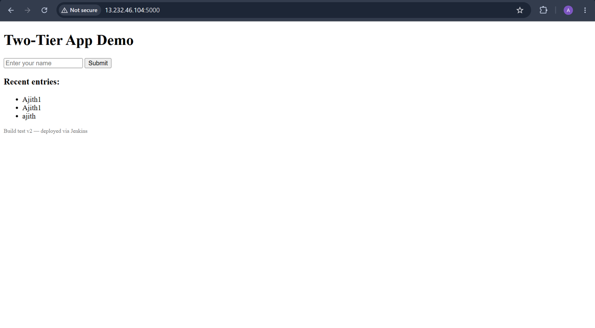
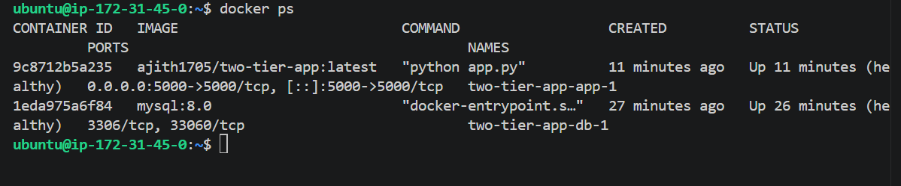
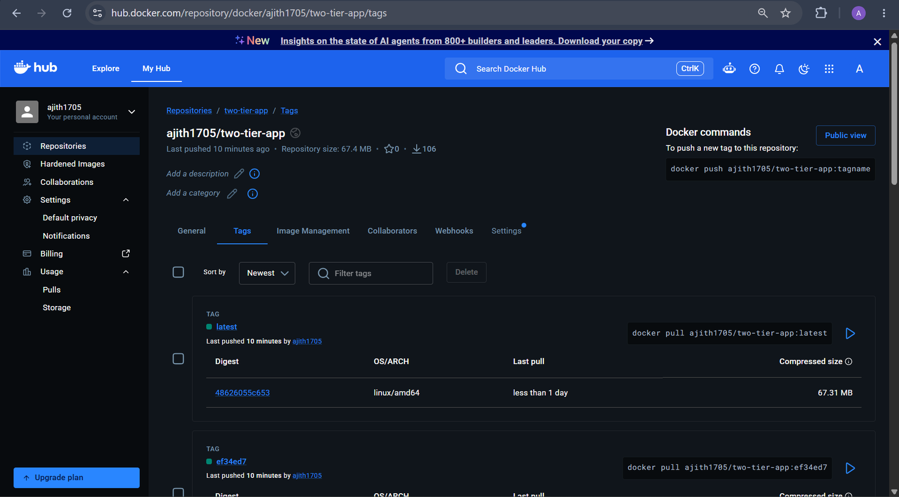
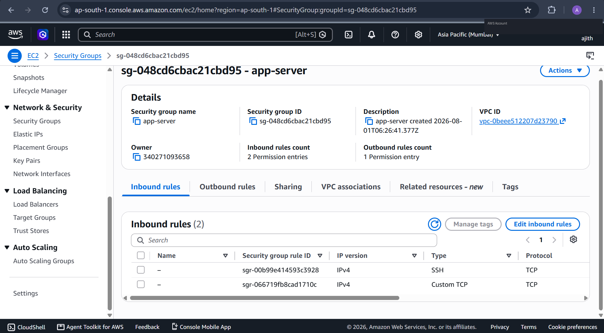
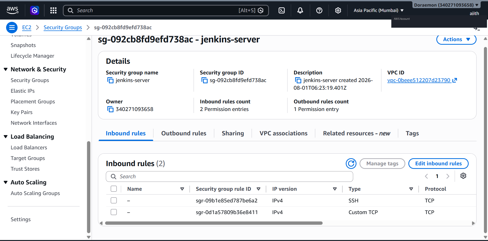
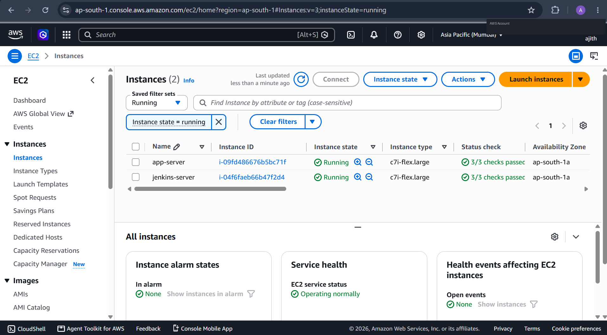
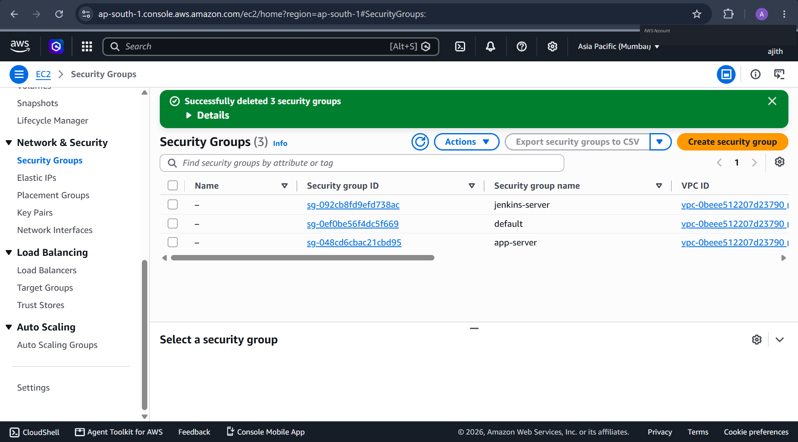

<div align="center">

# 🚀 Two-Tier App — CI/CD with Docker & Jenkins

**A production-style DevOps pipeline: Flask + MySQL, containerized, and deployed to AWS EC2 through a fully automated Jenkins CI/CD pipeline.**

[](https://hub.docker.com/repository/docker/ajith1705/two-tier-app)
[](#-cicd-pipeline)
[](#-architecture)
[](#-tech-stack)
[](#-tech-stack)

</div>

---

## 📖 Overview

This project demonstrates an **end-to-end DevOps deployment pipeline** built from scratch — not just "it runs in Docker," but a real CI/CD chain: a developer pushes code, a webhook triggers Jenkins, Jenkins tests and builds the app, pushes a versioned image to Docker Hub, deploys it to a live AWS server over SSH, and verifies the deployment actually succeeded — automatically, on every push.

It's a two-tier architecture: a **Flask** application tier and a **MySQL** database tier, each running in its own container, talking to each other over Docker's internal network, with data durability handled through a persistent volume.

---

## 🏗️ Architecture

<div align="center">

</div>

Two separate EC2 instances are used: one dedicated to running **Jenkins**, one dedicated to running the **app itself** — mirroring how a real build server is kept separate from production infrastructure.

---

## ✨ What This Demonstrates

| Area | What's implemented |
|---|---|
| **Containerization** | Multi-stage-ready Dockerfile, non-root container user, `HEALTHCHECK`, persistent named volume for MySQL durability |
| **CI/CD Automation** | Jenkins pipeline: Checkout → Unit Tests → Build → Push → Deploy → Verify — fully triggered by a GitHub webhook, zero manual steps |
| **Infrastructure** | Two-tier AWS EC2 setup — SSH between servers scoped to security-group-to-security-group rules, not open to the world |
| **Secrets Management** | Docker Hub and SSH credentials stored only in Jenkins' credential store — never hardcoded, never committed |
| **Testing** | Unit tests with mocked database calls (`unittest.mock`), safe to run in a CI environment with no live database |
| **Image Versioning** | Every build tagged with its Git commit SHA (not just `latest`) — always traceable back to the exact commit running in production |
| **Self-Healing Schema** | App initializes its own database schema on startup — not solely dependent on MySQL's fragile one-time init hook |

---

## 🔧 Tech Stack

`Python (Flask)` · `MySQL 8.0` · `Docker` · `Docker Compose` · `Jenkins` · `AWS EC2` · `GitHub Webhooks` · `Docker Hub`

---

## 🔄 CI/CD Pipeline

The Jenkins pipeline runs automatically on every push to `main`:

```
Checkout SCM → Run Unit Tests → Build Docker Image → Push to Docker Hub → Deploy to App Server → Verify Deployment
```

Every stage has to pass for the next to run — if unit tests fail, the broken code never gets built, pushed, or deployed.

<div align="center">


<sub><i>Full pipeline history — every stage passing end to end, triggered automatically by a GitHub webhook</i></sub>
</div>

<br>

<div align="center">


<sub><i>GitHub → Jenkins webhook: confirmed automatic trigger on every push</i></sub>
</div>

---

## 📦 The App, Live

<div align="center">


<sub><i>The deployed app — Flask reading/writing to MySQL, running on AWS EC2</i></sub>
</div>

<br>

<div align="center">


<sub><i>Both containers running healthy on the app server — app tier and DB tier, fully independent</i></sub>
</div>

---

## 🐳 Docker Hub

Every build produces a uniquely tagged image — never just `latest` — so any running deployment can be traced back to the exact commit that built it.

<div align="center">


<sub><i>Commit-SHA-tagged images on Docker Hub — full build traceability</i></sub>
</div>

---

## 🔐 Security Groups

SSH access from the Jenkins server to the app server is scoped by a **security-group-to-security-group** rule, not an IP allow-list — so it keeps working even if an instance restarts and gets a new IP, and it isn't open to the internet.

Jenkins' webhook listener (port 8080) is a separate, deliberate exception: GitHub's webhook servers call in from a wide, non-fixed IP range, so that port is opened broadly rather than IP-restricted. For a single-VM learning setup this is an accepted trade-off; in production this would sit behind a reverse proxy or a narrower allow-list instead of a raw open port.

<div align="center">

<br><br>


<sub><i>App server: SSH restricted to Jenkins's security group. Jenkins server: SSH restricted similarly, webhook port intentionally open for GitHub</i></sub>
</div>

---

## 🧹 Infrastructure Cleanup

Cost-consciousness matters in real environments — after validating the full pipeline, all EC2 instances, security groups, and any unattached Elastic IPs were deliberately torn down to avoid ongoing AWS charges.

<div align="center">

<br><br>


<sub><i>Clean teardown after validation — no orphaned resources left billing silently</i></sub>
</div>

---

## 🚧 Real Debugging Journey (Lessons Learned)

This project wasn't "clone, deploy, done" — building it surfaced a string of genuinely real-world issues, each root-caused from actual log evidence (`journalctl`, `docker logs`, Jenkins console output) rather than trial-and-error:

- **GitHub webhook connectivity** — diagnosed via GitHub's delivery logs vs. Jenkins' own trigger config, isolating whether a failure was network-side or configuration-side
- **SSH connectivity between servers** — traced a connection timeout down to a security group rule, verified with a direct manual SSH test before trusting Jenkins' credential setup
- **Deploy path mismatches** — a Dockerfile and compose file split across the wrong directories caused a silent build-context failure; fixed by aligning the actual file layout with what the build expected
- **MySQL init-script race condition** — `init.sql` only runs against a truly empty volume; a partially-failed earlier deploy had silently skipped schema creation, so the fix had to address the root cause, not just recreate the table once
- **Python import-time bug** — a database self-healing fix accidentally ran at *import* time, crashing unit tests that don't have a live database available in the CI environment; fixed by scoping it to the app's actual startup path

Each of these was resolved by reading the actual error output carefully and testing one hypothesis at a time — which is, honestly, the real skill this project ended up demonstrating.

---

## 🗂️ Project Structure

```
Two-Tier-App/
├── app/
│   ├── app.py              # Flask application
│   ├── requirements.txt
│   ├── test_app.py         # Unit tests (mocked DB)
│   ├── init.sql            # DB schema (MySQL first-boot init)
│   └── templates/
│       └── index.html
├── Dockerfile
├── docker-compose.yml       # Local development (build: .)
├── docker-compose.prod.yml  # Production (image: from Docker Hub)
├── Jenkinsfile
└── README.md
```

---

## ⚙️ Getting Started (Local)

```bash
git clone https://github.com/Ajithkumar1705/Two-Tier-App.git
cd Two-Tier-App
cp .env.example .env      # fill in your own DB credentials
docker compose up --build
```

Visit **http://localhost:5000**

---

## 📄 License

This project is for educational/portfolio purposes.

</div>
